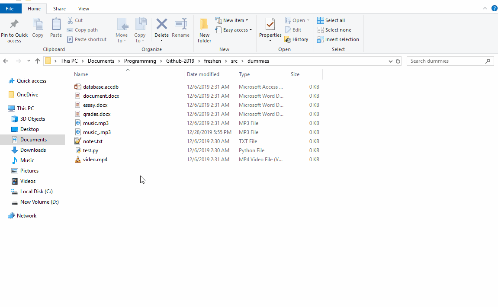

# freshen

[](https://pypi.python.org/pypi/ansicolortags/)
## What is freshen?

A program that sorts files based on various attributes from the windows context menu. Simply install the program and your context menu will have an added `Sort Files` entry.

Nothing complicated, it gets the job done.

## What is the context menu?

The context menu is the option menu created from right clicking, such as:


# Installation

* ## Install from PyPI
First, install the pip package
```python
pip install freshen-sorter
```
and run the following command to install to the context menu. This requires administrator permissions.
```python
freshen -i
```
And you're done!
* ## Installing from Source files

1. Download the [latest release](https://github.com/saleguas/freshen/releases) from the repository.

2. Unzip the folder to a location where it won't be moved.

3. Run the `reginstall.py` file


# Usage
Made to be simple! No complicated command lines needed.
1. Install the required files.
2. Right click on the background of any Directory
3. Go to the `Sort Files` option and selected the desired organizer.


# Organizers

There are __four__ different options to organize files.
* ## Sort by File Type
Probably the most useful organizer. Sorts each file into a folder based on the `config/filegroups.yml` file. The file already comes with the most common file extensions for each type of file(pictures, videos, etc.)

### filegroups.yml
As mentioned earlier, the `Sort by File Type` uses the `filegroups.yml` to determine organization. This file can be manually changed to change the desired output, and the organization is quite straightforward.
```yaml
# Audio Files
audio:
  - aif
  - cda
  - mid
  - midi
  - mp3
  - mpa
  - ogg
  - wav
  - wma
  - wpl
# Archive files
archives:
  - 7z
  - arj
  - deb
  - pkg
  - rar
  - rpm
  - tar.gz
  - z
  - zip
# etc.
  ```
You can either change the `filegroups.yml` file in the `src` directory and use the files built from the `src` folder, or if you already have the built files you can directly change the file in the `dist` directory. The context menu reads the file every time it is ran, so it will instantly update.


* ## Sort by extension
Quite straightforward. Sorts each file into folders exclusively based on their extension.


* ## Sort by Date
The only option that uses a cascading context menu(nested menus).


 Sorts each file by the __DATE MODIFIED__ attribute of the file. Has three options:

  * ### Day
  Sorts up to the Day modified. Takes into account the year, month, and day.
  ```js
  shortcuts
  ├── _2019-05-16
  ├── _2019-05-19
  ├── _2019-05-24
  └── _2019-06-28
  ```
  * ### Month
  Sorts up to the Month modified. Takes into account the year and month.
  ```js
  shortcuts
  ├── _2019-05
  └── _2019-06
  ```

  * ### Year
  Sorts up to the Year modified. Takes into account only the year.
  ```js
  shortcuts
  └── _2019
  ```

* ## Uproot Files
The only option that isn't actually a sort. **Recursively** moves every file of every subdirectory from the current location to the current location. Useful for getting rid of unnecessary folders and flattening out a directory. For example:
```js
  dummies
  ├── Others
  │   └── database.accdb
  ├── audio
  │   ├── _2019-12-06
  │   │   └── music.mp3
  │   └── _2019-12-28
  │       └── music_.mp3
  ├── documents
  │   ├── _docx
  │   │   ├── document.docx
  │   │   ├── essay.docx
  │   │   └── grades.docx
  │   └── _txt
  │       └── notes.txt
  ├── executables
  │   └── test.py
  └── videos
      └── video.mp4
```
Would be converted to:
```js
dummies
├── database.accdb
├── document.docx
├── essay.docx
├── grades.docx
├── music.mp3
├── music_.mp3
├── notes.txt
├── test.py
└── video.mp4
```
 **BE VERY CAREFUL USING THIS!** It is easy to permanently ruin a directory or files, especially if something relies on a specific folder tree, for example the windows directory.

# Extra Information
If you are working with the source files do NOT move the files after running `reginstall.py` as it might cause the code to be unstable. The registry points to the absolute path of the files when installed and does not update.

Files shouldn't be deleted or corrupted, as they haven't through all my testing so far. But keep in mind anything is possible, and if you data is THAT important you should probably back it up somewhere. Keep in mind I am NOT responsible for any damages that may arise from this program. Use it at your own risk.

# Licensing

This project is licensed under the terms of the [MIT license](https://github.com/faheel/cleanup/blob/master/LICENSE).
